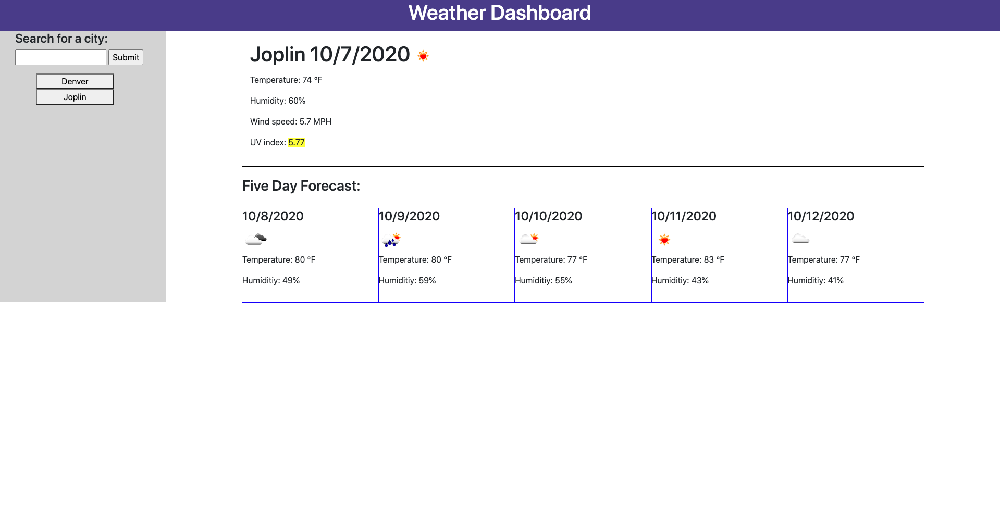

# weatherDashboardHW

## Description

Using HTML, CSS, Bootstrap, and Javascript I created an application that can display the forecast for a city, after the user types it in or selects it. It displays both the current forecast and a 5 day forecast for the future. The city the user types in is saved to the search history, and the user can click on any button in search history to pull up that forecast again.

## Usage

Type a city into the search bar to pull up its forecast, or select one from the search history if you want that to city to pull up.

## Link to Application

https://tmessall.github.io/weatherDashboardHW/
